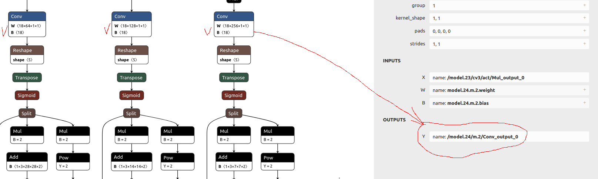

# An Example Workflow for MaixCam (SOPHGO SG2002) Model Conversion

Example for Ultralitics YOLOv5.

## Step 1 Model transformation

Open the model in Netron (https://netron.app/) and check the name of the last convolutions in your model.



```
model_transform \
--model_name yolov5s \
--model_def model.onnx \
--input_shapes [[1,3,224,224]] \
--mean 0.0,0.0,0.0 \
--scale 0.0039216,0.0039216,0.0039216 \
--keep_aspect_ratio \
--pixel_format rgb \
--output_names "/model.24/m.0/Conv_output_0","/model.24/m.1/Conv_output_0","/model.24/m.2/Conv_output_0" \
--mlir yolov5s.mlir
```

## Step 2 Quantization calibration

Use some images from your dataset, about 100 is enough. They do not need to be labeled - but they need to be somewhat representative of the data the model will encounter later. In plain words - if you want to detect rabbits, feed pictures of rabbits for calibration, NOT the racoons.

```
run_calibration yolov5s.mlir \
--dataset testing \
--input_num 100 \
-o yolov5s_cali_table
```

## Step 3 Final deployment

As output you will get cvimodel file. You will need to create a simple model description file by yourself, just modify the example I have here (`model.mud`) and copy both files to MaixCam.

```
model_deploy \
--mlir yolov5s.mlir \
--quantize INT8 \
--calibration_table yolov5s_cali_table \
--processor cv181x \
--model yolov5s_cv181x_int8_sym.cvimodel
```